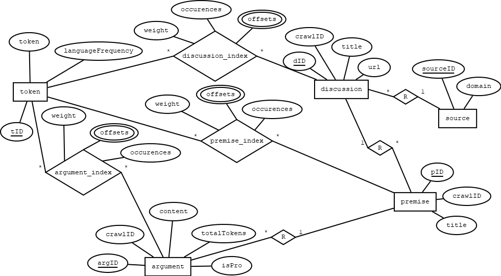

# Information Retrieval - Argument Search Engine

## Database Configuration

### Arch Linux

Install package  
`$ sudo pacman -S postgresql`

Login as PostgreSQL user  
`$ sudo -iu postgres`

Initialize database cluster  
`[postgres]$ initdb --locale=en_US.UTF-8 -E UTF8 -D /var/lib/postgres/data`

Start and enable postgres service (as root)  
`[postgres]$ exit`  
`$ sudo systemctl enable postgresql.service`  
`$ sudo systemctl start postgresql.service`  

Login as PostgreSQL user and create a new user
`$ sudo -iu postgres`  
`[postgres]$ createuser -d -w irargdb`

Create a new database  
`[postgres]$ createdb argdb -O irargdb`

Check connection to database  
`[postgres]$ createdb argdb -O irargdb`

To login from shell use following command:  
`$ psql -U irargdb -d argdb`

## ER-Model

